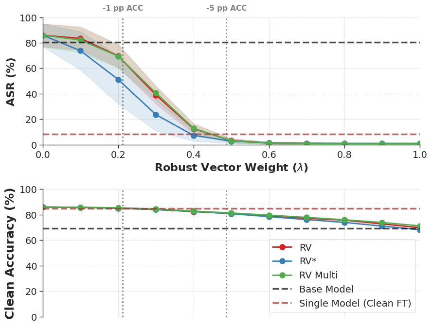
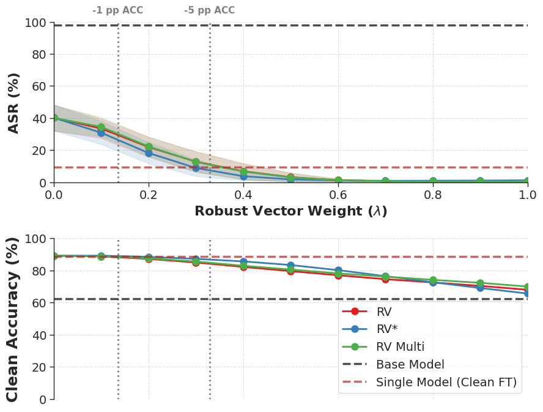
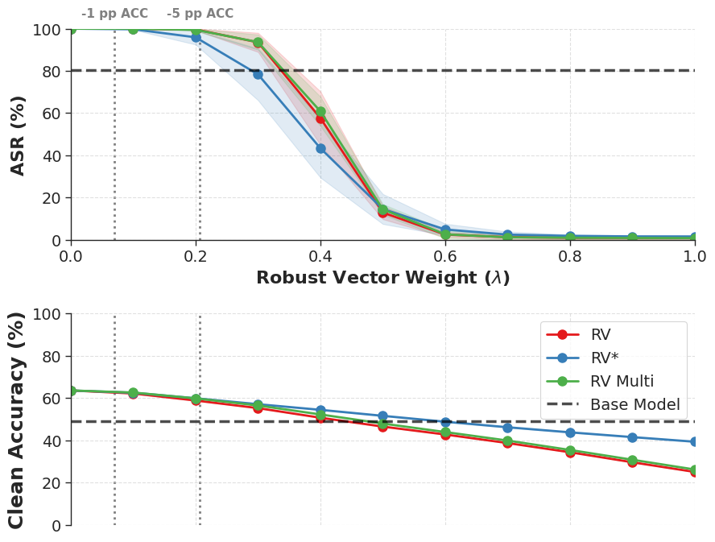
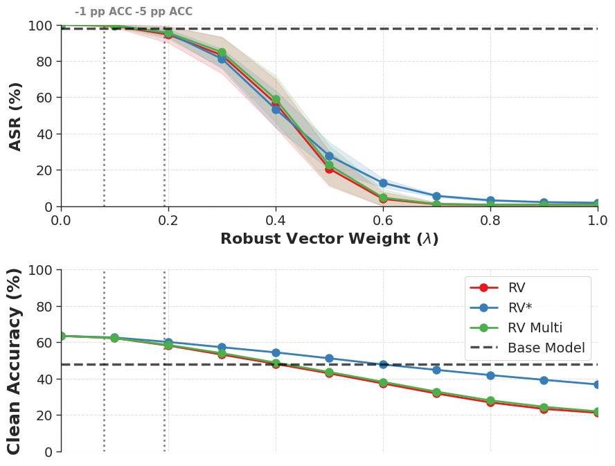

# Robustness Vectors for Secure Model Merging

  

> **TL;DR:** This repository contains the official codebase for **Robustness Vectors (RV)**—a lightweight, parameter-space defense mechanism that mitigates backdoor vulnerabilities in merged Vision-Language models (e.g., ViT/CLIP) without requiring retraining from scratch.

## Project Status
**Active Development.** We are currently scaling the RV framework to evaluate transferability across larger architectures (e.g., ViT-L) and full-scale benchmark datasets (ImageNet-1K) for a full-length manuscript.

## Overview
Model merging (e.g., Task Arithmetic) enables efficient capability composition but is highly vulnerable to backdoor transfer: a single poisoned contributor can compromise the entire merged model. We introduce the **Robustness Vector (RV)**, defined as the weight difference between an adversarially fine-tuned model and a standard clean fine-tuned model. By injecting a scaled RV during the merging process, we algebraically shift the compromised weights toward a robust manifold, acting as a lightweight "vaccine".

### 📊 Key Results: The ASR vs. Clean Accuracy Trade-off

Injecting the Robustness Vector acts as a tunable "vaccine" during model merging. By sweeping the Robust Vector Weight ($\lambda$), we observe a dramatic collapse in Attack Success Rate (ASR) with minimal degradation to Clean Accuracy. 

Below, we demonstrate this dynamic across both Single-Task (ST) and Multi-Task (MT) merging scenarios for Vision-Language models.

<p align="center">
  <strong>Single-Task Merging (ImageNet100 (left) & CIFAR100 (right)</strong><br>
  
  
</p>

<p align="center">
  <strong>Multi-Task Merging (ImageNet100 (left) & CIFAR100 (right))</strong><br>
  
  
</p>

> *The figures illustrate the impact of the RV parameter ($\lambda$) on both ASR (top subplots) and Clean Accuracy (bottom subplots). At optimal $\lambda$ values, our RV patching (red line) neutralizes the backdoor threat while remaining highly competitive with the base merged model.*

## Installation & Setup

This project is built to run efficiently on HPC clusters (e.g., SLURM) and local environments using standard Python virtual environments and Python 3.12.3.

```bash
# Clone the repository
git clone https://github.com/karolrogozinski/robustness-vectors-for-secure-model-merging.git
cd robustness-vectors-for-secure-model-merging

# Create and activate a virtual environment
python3 -m venv venv
source venv/bin/activate  # On Windows use: venv\Scripts\activate

# Install dependencies
pip install -r requirements.txt
```

## Quickstart

You can reproduce the core merging and RV-patching pipeline using the provided CLI tools.
Remember to add desired parameters in bash scripts.

**1. Finetune Task, Backdoor, and Robust Models:**
```bash
bash finetune_clean.sh
bash finetune_robust_pgd.sh
bash finetune_badmergingon.sh
```

**2. Calculate Vectors:**
```bash
bash extract_vector.sh
```

**3. Run and save experiments:**
```bash
bash eval_task_arithmetic_unified_rv.sh
```

## Acknowledgments
This codebase builds upon the foundation and threat models established by the **[BadMerging](https://arxiv.org/abs/2408.07362)** framework and their **[Code](https://github.com/jzhang538/BadMerging)**. We thank the authors for their open-source contributions.
